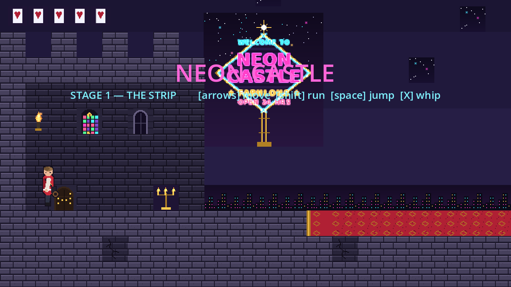
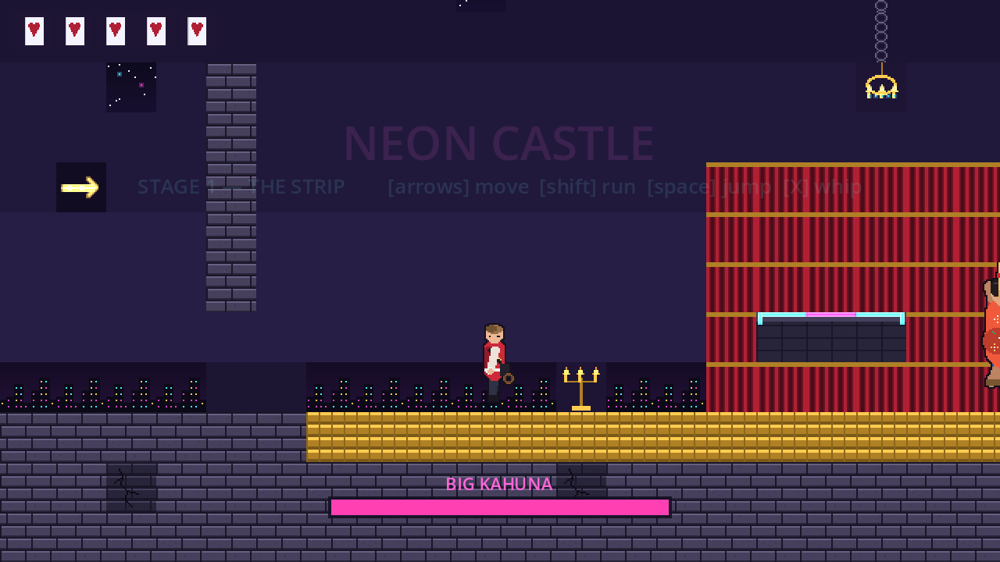

# NEON CASTLE 🏰✨

*A Castlevania-styled Vegas platformer made in Godot.*

Marshall has whipped his way into the **Neon Castle** — a gothic casino glowing
on the edge of the strip. At the end of the stage waits his boss, the
**BIG KAHUNA** (curl bouncing with managerial fury), armed with the
*Sub of Destiny* and one demand:

> "The Firehouse Subs reunion event. Saturday. 0900 sharp. Attendance is MANDATORY."

Decline by force.

## How to run

1. Install [Godot 4.3+](https://godotengine.org/download) (standard build, no .NET needed).
2. Open Godot → **Import** → select this folder's `project.godot`.
3. Press **F5** (Run Project).

## Controls

| Key | Action |
| --- | --- |
| ← / → or A / D | Move |
| Shift (hold) | Run |
| Space / W / ↑ | Jump |
| X or J | Whip / advance dialogue |
| R | Restart after game over / stage clear |

## The stage

- **The Entrance** — leave the old castle behind, cross the red carpet.
- **Spike pits** — twice. Vegas has a cover charge.
- **Neon platforms** — hop the floating cyan ledges under the chandelier.
- **The slot machine pillar** — climb the staircase, admire the slots.
- **The casino strip** — railings, torches, flying cards and dice.
- **The arena** — gold floor, red curtains. The gate slams shut behind you.

Marshall has 5 hearts and a checkpoint mid-stage plus one at the arena gate.
The Big Kahuna has a 14-segment health bar, a 360° sub swing, and a slam attack
that sends a toasted shockwave skimming along the floor — jump it or perch on
the arena platform.

Win, and your reunion RSVP gets downgraded to *tentative*.

## Project layout

- `assets/` — sprite sheets (hero, boss, tileset, welcome sign)
- `scenes/` — `main.tscn` (the stage), `player.tscn`, `boss.tscn`, `shockwave.tscn`
- `scripts/` — GDScript for the player, boss AI, HUD, dialogue and stage logic
- `tools/gen_scenes.py` — regenerates the three big scenes (level layout lives here)
- `tools/smoke_test.gd` — headless test: `godot --headless -s tools/smoke_test.gd`
- `docs/reference/` — annotated sprite sheets and the level mockup
